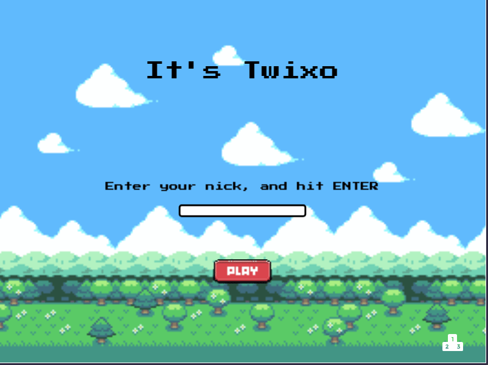

# It's Twixo - Platform Game

> This is a platform game built with JavaScript, Webpack, Phaser Framework and Jest testing

## Built With

- JavaScript
- HTML
- CSS
- ESLint
- Stylelint
- Webpack 5
- Yarn
- Phaser 3
- Jest

## General instructions

When you open the game... 

- Enter a nickname, if you want to save your score.
- Click on Play
- Use `LEFT CLICK` to jump;
- If you hit an obstacle or fall, you lose
- You'll be prompted to save your score, but only if you have entered a nickname.

You can read all the Game design details [here](./demo/GDD.md)

## Live version

You can check the live version in [this link](https://sleepy-jepsen-2ce943.netlify.app/)

## Getting Started

To run this project locally, make sure you have the following installed:

- Node.js, more information [here](https://nodejs.org/en/)
- Yarn package manager, more information [here](https://yarnpkg.com/)

### Setup and Install

- Clone this repository using the link above (click on the 'code' button)
- Open a terminal and `cd` to the cloned repository
- Run `yarn` to set up all dependencies
- Run `yarn serve` to start the server

### Usage

- Open your preffered browser
- Visit `http://localhost:8080/`

## Acknowledgements

All the amazing artwork used on this project were created by the following artists:

- Character and background design by [GrafxKid](https://grafxkid.itch.io/)
- Background Music by [ArcOfDream](https://arcofdream.itch.io/monolith-ost)
- UI elements by [Kenney](https://opengameart.org/content/game-icons)
- UI elements by [Mikiz](https://mikiz.itch.io/buttons-pack-46-buttons)

## Authors

👤 **Gustavo Carvalho**

- GitHub: [@gscarv13](https://github.com/gscarv13)
- Twitter: [@Gscarv13](https://twitter.com/Gscarv13)
- LinkedIn: [Gustavo Carvalho](www.linkedin.com/in/gscarv13)

## 🤝 Contributing

Contributions, issues, and feature requests are welcome!

Feel free to check the [issues page](https://github.com/gscarv13/its-twixo/issues).

## Show your support

Give a ⭐️ if you like this project!
